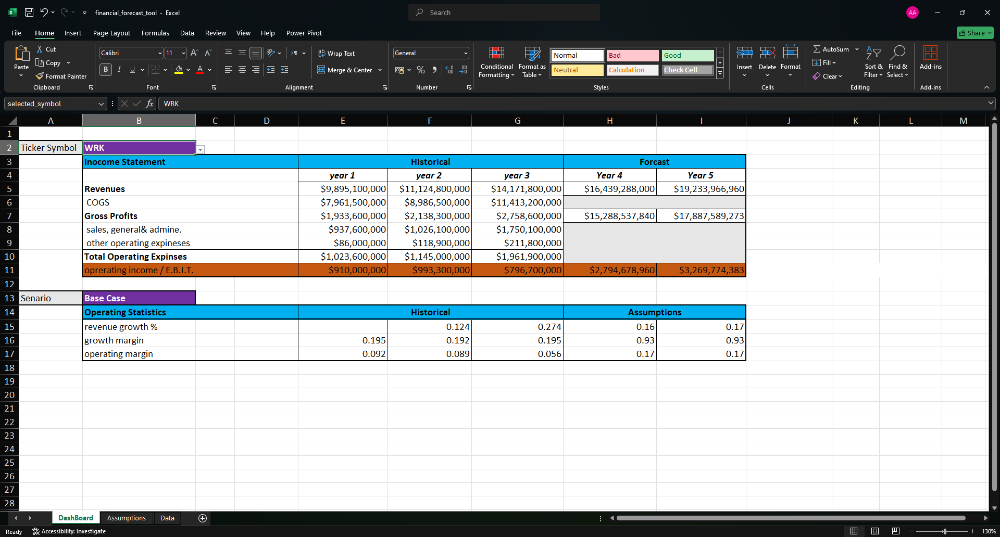

# Financial Forecasting Tool

  
*Interactive Excel dashboard with dynamic dropdowns for ticker symbols and scenarios.*

---

## 🧰 Key Features
### 1. **Scenario-Specific Assumptions**  
  
*Year 4–5 growth rates and margins by scenario (Base/Strong/Weak).*  

### 2. **Company-Specific Projections**  
- **WRK Case**: Customizable growth rates and margins for targeted analysis.  
- **Dynamic Tickers**: `=UNIQUE(tickersymbol)` auto-populates symbols (NAVI, PYPL, QRVO, WRK).  

---

## 🛠️ Tool Breakdown
### Assumptions Panel (`assumptions.png`)  
| Scenario    | Year 4 | Year 5 |  
|-------------|--------|--------|  
| **Revenue Growth** |        |        |  
| Base        | 16.0%  | 17.0%  |  
| Strong      | 15.5%  | 15.5%  |  
| Weak        | 14.0%  | 14.0%  |  
| **Gross Margin**   | 93%    | 93%    |  
| **Operating Margin** | 17%   | 17%    |  

### WRK-Specific Analysis  
- **Historical Data**: Year 3 revenues of **$14.2B** with operating margins as low as **0.17%**.  
- **Forecasts**: Year 5 revenue projections up to **$19,2B** under Strong Case.  

---

## 🚀 Getting Started
1. **Clone the Repository**:  
   ```bash
   git clone https://github.com/abdalrhman-abas-0/financial-forecasting.git
   ```

2. **Open `financial_forecast_tool.xlsx`** in Excel (2016+).  

3. **Select Ticker & Scenario**:  
   - **Ticker Symbol**:  
     - Go to cell **B2** (named `selected_symbol`).  
     - Click the dropdown arrow to select a company (e.g., WRK, PYPL, NAVI).   
   - **Scenario**:  
     - Go to cell **B13** (named `selected_scenario`).  
     - Choose **Base**, **Strong**, or **Weak** from the dropdown.  

4. **Analyze Projections**:  
   - **Dashboard**: View 5-year income statements and margins.  
   - **Data Sheet**: Edit historical data to update forecasts.  

---

## 📈 Methodology
### 1. **Data Integration**  
- **unique_ticker_symbols**: Dynamically extracted using `=UNIQUE(tickersymbol)`.  
- **Assumptions**: Pulled from `assumptions.png` logic.  

### 2. **Scenario Logic**  
- **Base Case**: Maintains historical CAGR.  
- **Strong/Weak**: Adjusts growth rates ±25%.  

---

## 🔧 Customization
1. **Add New Tickers**:  
   - Append data to the `Data` sheet (ensure that `ticker_symbol`, `years`, `period_ending`, `total_revenue`, `cost_of_revenue`, `sales_general_and_admin`, `other_operating_items`, `growthprofits`, `operatingprofits`, `growthmargin`, and `operatingmargin` ranges are updated).  
   
2. **Modify Scenarios**:  
   - Edit the `Operating Senarios-Sensatie Analysis` percentages in the `Assumptions` sheet.  
